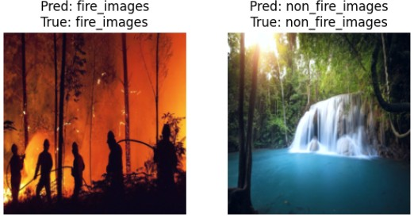

# 🔥 Fire Detection using MobileNet (CNN)

This project provides a lightweight and efficient solution for fire detection from images using a **convolutional neural network** based on **MobileNetV3-Small**.


## 📸 Example Outputs

| Fire Images Example               |
| --------------------------------- |
|  |


## 📁 Overview

- Downloads and prepares a fire dataset using KaggleHub
- Applies preprocessing and data augmentation
- Trains a MobileNetV3-Small model with class balancing
- Evaluates with accuracy/F1/precision and confusion matrix
- Exports the trained model to TorchScript
- Makes predictions on new images
- Visualizes classification errors


## 🛠️ Requirements

Install the necessary libraries:

```bash
pip install torch torchvision torchaudio
pip install matplotlib pandas scikit-learn tqdm torchsummary kagglehub
```


## 📂 Dataset

We use the [fire-dataset](https://www.kaggle.com/datasets/phylake1337/fire-dataset), which contains labeled images of 1000 different fire or non-fire.
The dataset is from phylake1337/fire-dataset, containing two categories:
- fire_images
- non_fire_images
The dataset is automatically downloaded using `kagglehub`:
```bash
import kagglehub

# Download latest version
path = kagglehub.dataset_download("phylake1337/fire-dataset")

print("Path to dataset files:", path)
```


## 📘 Language

- Python


## 🧠 Model Used

The model is based on MobileNetV3-Small, pretrained on ImageNet. The final classification layer is modified for binary classification (fire vs non-fire).
```bash
model = mobilenet_v3_small(weights=MobileNet_V3_Small_Weights.IMAGENET1K_V1)
model.classifier[3] = nn.Linear(model.classifier[3].in_features, 2)
```


## 🏋️ Training

- Trains for up to 30 epochs with early stopping (patience = 5)
- Uses WeightedRandomSampler to handle class imbalance
- Optimizer: Adam
- Scheduler: ReduceLROnPlateau
- Training logs are saved to training_log.csv


## 📊 Evaluation

- Metrics: Accuracy, Precision, Recall, F1 Score
- Confusion matrix visualization
- Training and validation loss/accuracy plots
- Misclassified image visualization
- Random prediction previews